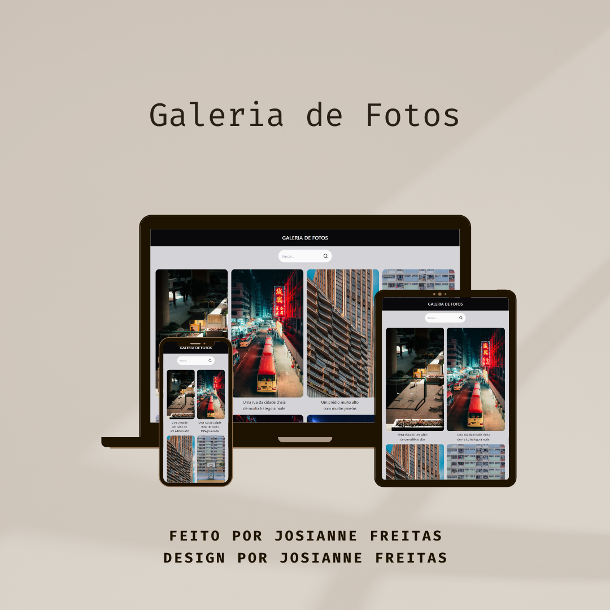

<h1 align="center">Galeria de Fotos</h1>



<div align="center">

[]()
[](https://github.com/josiannefreitas/photo-gallery/issues)
[](https://github.com/josiannefreitas/photo-gallery/pulls)
[](/LICENSE)

</div>

---

<p align="center"> Uma aplicação web que exibe uma galeria de fotos, permitindo que os usuários visualizem, filtrem e pesquisem imagens com base em palavras-chave.
    <br> 
</p>

## 📝 Tabela de conteúdos

- [Sobre](#about)
- [Introdução](#getting_started)
- [Implementação](#deployment)
- [Utilização](#usage)
- [Construído com](#built_using)
- [Autora](#authors)

## 🧐 Sobre <a name = "about"></a>

Uma aplicação web responsiva que exibe uma galeria de fotos, que permite a visualização, filtragem e pesquisa de imagens em tempo real através de palavras-chave.

É possível acessar e visualizar a aplicação [aqui](https://josiannefreitas.github.io/photo-gallery/).

## 🏁 Introdução <a name = "getting_started"></a>

Essas instruções farão com que você tenha uma cópia do projeto instalada e em execução em seu computador local.

### Instalação

Clone o projeto ou o fork do projeto com o seguinte comando:

```bash
git clone https://github.com/josiannefreitas/photo-gallery.git
```

Em seguida, instale as dependências:

```bash
npm install
```

## 🎈 Utilização <a name="usage"></a>

Esta aplicação é uma interface que exibe um cabeçalho, uma barra de pesquisa, uma galeria de fotos e um rodapé. Para executar a aplicação, você precisa abrir a pasta local na qual você clonou o repositório no terminal e executar o comando:

```bash
npm run dev
```

Ao executar o comando acima, a aplicação já estará em funcionamento e o link para exibição da aplicação será mostrado no terminal.

A barra de pesquisa filtra as imagens em tempo real, fazendo a correspondência entre os caracteres digitados e o texto constante no nome das imagens, passando a exibir apenas as imagens correspondentes.

Não havendo nenhuma correspondência, será exibida em tela a mensagem:

```
Nenhuma foto encontrada
```

As imagens são exibidas em um grid, apresentando efeito visual de zoom na imagem e de negrito no texto, ao passar o mouse sobre o conteúdo.

## ⛏️ Construído com <a name = "built_using"></a>

[](https://skillicons.dev)

- [Git](https://git-scm.com/) - Controle de versão
- [Github](https://github.com/) - Armazenamento de código
- [VSCode](vscode) - Editor de código
- [Vite](https://vite.dev/) - Ferramenta de build rápida
- [React](https://react.dev/) - Biblioteca frontend
- [JavaScript](https://www.javascript.com/) - Linguagem de programação
- [TypeScript](https://www.typescriptlang.org/) - Linguagem de programação
- [TailwindCSS](https://tailwindcss.com/) - Framework CSS

## ✍️ Autora <a name = "authors"></a>

Josianne Maria de Freitas | anne.jmfreitas@gmail.com

- [@josiannefreitas](https://www.github.com/josiannefreitas)
